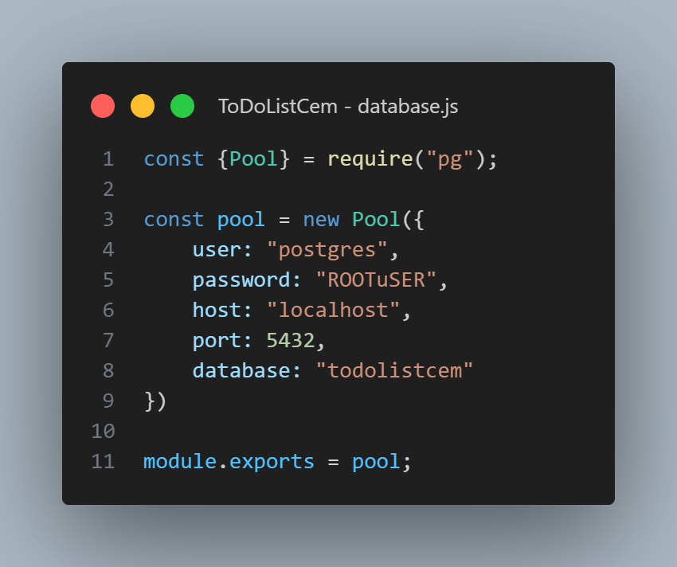

# Projeto Lista de Tarefas

Este projeto está sendo desenvolvido com: React + Vite, Node.js, Nodemon, Express, postgreSQL e Tailwindcss.

# Como utilizar
O banco de dados está sendo utilizado de maneira local, logo, é necessário configurar o acesso ao postgreSQL em: 'server/database.js'

Em seguida realizar o comando `npm run dev` nas pastas `client` e `server`.

# <h3>Projeto sendo desenvolvido por Raynner Brito Vicente&reg;</h3>